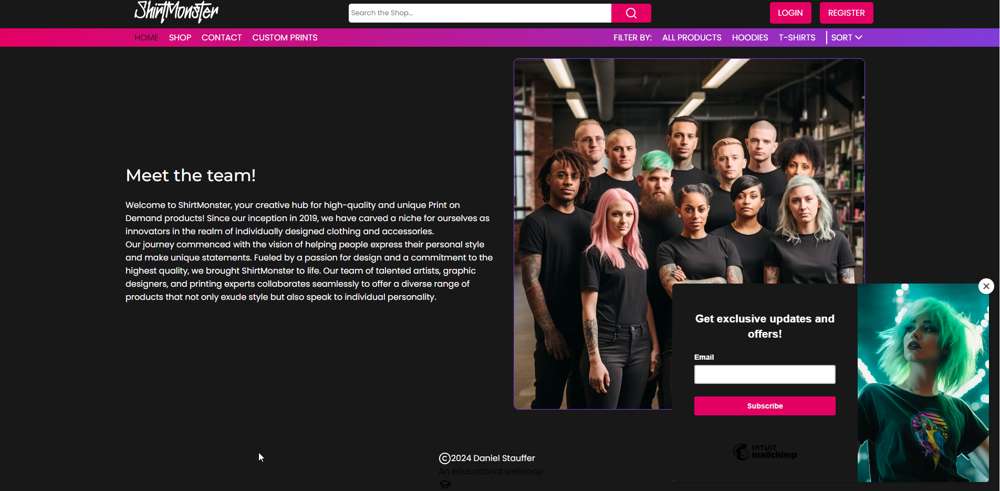
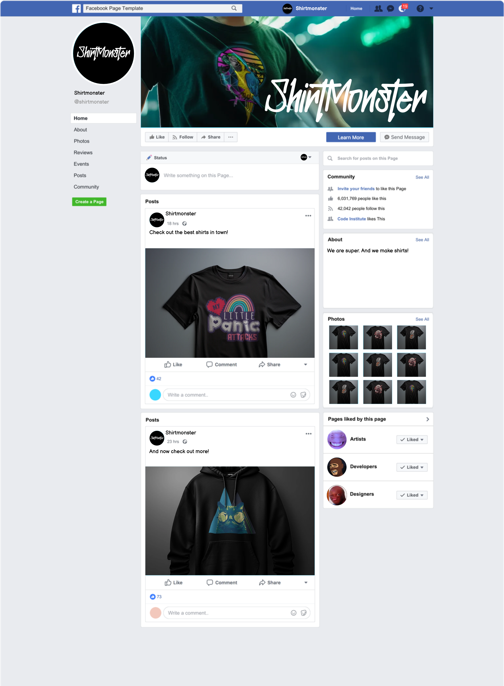
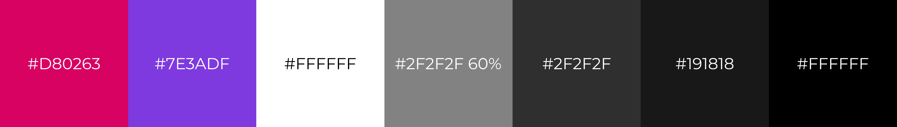
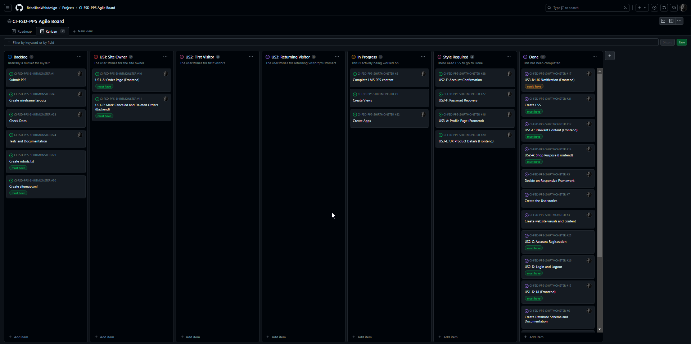
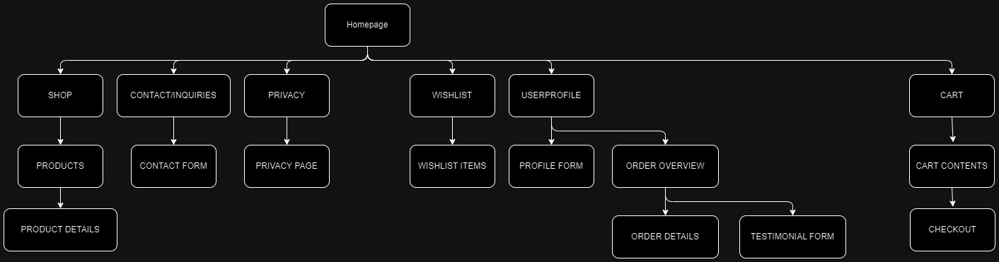
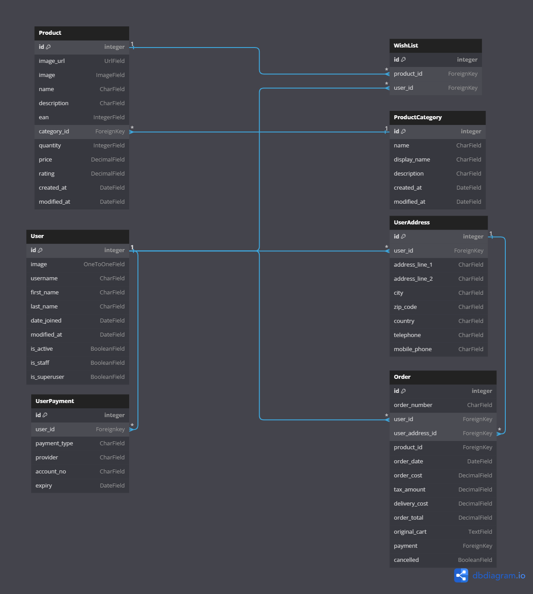
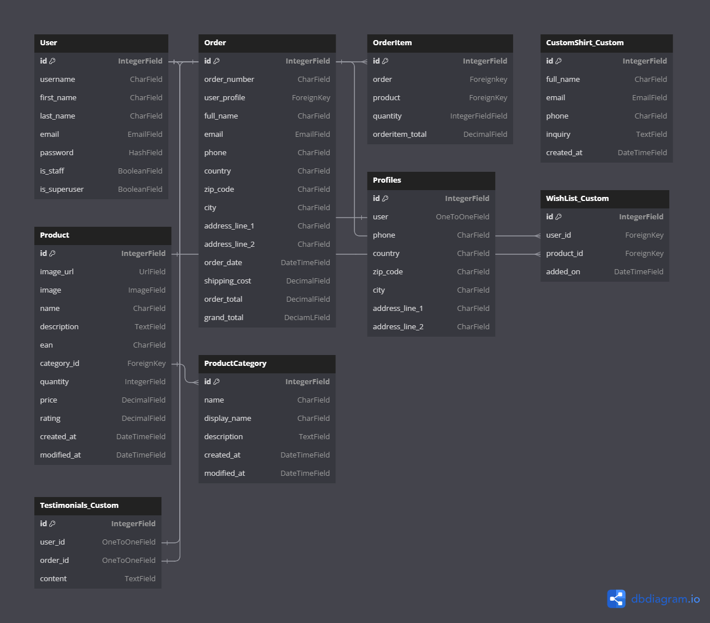

## OVERVIEW

Shirtmonster is an educational eCommerce website where customers can buy apparel products like t-shirts and hoodies. It was created as the 5th portfolio project for the full stack developer course at [Code Institute](https://codeinstitute.net/). The website can be visited [here](https://shirtmonster-c4453ded83e7.herokuapp.com).

## UX

### Target Audience

The website is geared towards young and stylish people who like to wear printed shirts. This is emphasized by using images of young and "unusual" looking persons wearing the websites´ products. Also the team image was made with the intention to show users that the website staff is made of people who look the same they do. This gives a sense of customers and staff belonging together and helps the customer to sympathize with the staff.

### User Stories

#### Shop Owner

| ISSUE ID | USER STORY                                                   | FULFILLED |
| -------- | ------------------------------------------------------------ | --------- |
| #10      | As the site owner I want to have a page where I can see all orders, so I can look them up easily. | PARTLY    |
| #11      | As the website owner I want canceled or deleted orders to remain in the database, so I can analyze them. | NO        |
| #12      | As the website owner I want relevant website content to be displayed, so customers know what the website is about. | YES       |
| #13      | As the website owner I want a modern dark website design.    | YES       |
| #31      | As the site owner I want the site to display a newsletter signup, so visitors and customers can sign up for news. | YES       |

#### First Time Visitor

| ISSUE ID | USER STORY                                                   | FULFILLED |
| -------- | ------------------------------------------------------------ | --------- |
| #14      | As a first time visitor I want to know immediately know what the website is about, so I can decide if want to buy something. | YES       |
| #15      | As a first time visitor I want to navigate easily and intuitively through the website. | YES       |
| #25      | As a first time visitor I want to be able to register an account. | YES       |
| #26      | As a registered first time visitor I want to confirm my account with an email. | YES       |

#### Returning Visitor

| ISSUE ID | USER STORY                                                   | FULFILLED |
| -------- | ------------------------------------------------------------ | --------- |
| #16      | As a customer I want to be able to view my data in an overview. | YES       |
| #17      | As a customer I want to be notified when my wishlist is changed so I can decide if want to something from it. | YES       |
| #18      | As a customer I want to be able to add an item easily to my wishlist. | YES       |
| #19      | As a customer I want to be able to delete an item easily from my wishlist. | YES       |
| #20      | As a customer I want to be able to easily view product details. | YES       |
| #27      | As a registered user I want to recover my password easily if I forget it. | YES       |
| #26      | As a registered user I want to be able to easily log in and out. | YES       |

## Business Model

he business model is B2C (Business to Customer), this means the business sells to customers only. It is possible for musicians and other persons to write an inquiry for a custom shirt, but these are not offered in large quantities.

### The Customer Persona

The website is aimed at a diverse group of persons. May it be young people to adults which have a taste for printed apparel. The customers age might be between 18 to 45 years. The shops emphasis lies in a stylish, dark and modern design providing users the options they need to purchase something quick and easily.

## Web Marketing

### Newsletters

Newsletters are handled via [Mailchimp](https://mailchimp.com/), there is a newsletter sign-up form appearing at the bottom of the page when the user scrolls down.

  
Mailchimp Signup

 

To be consize with the german market and its customers, newsletters are only sent when real news are available. For the purpose of this MVP and the limitations of the free Mailchimp plan newsletters wont be sent. Mailchimp free only allows to send newsletters immediately. There is no automation available.

### Facebook

For more presence in the internet and for access to a wide and diverse audience via targeting ads, a facebook page could be made. The mockup page below shows how it could look, according to the old facebook design.

  
Facebook Mockup

 

In any case there are more possibilities like X/Twitter, Instagram, TikTok and others to widen the audience even more and get more targeted ads out.

### Meta Tags

For good SEO results, meta tags were used. The process for finding the correct and important meta tags is as follows:

- Find initial keywords to use (streetwear, print on demand, t-shirt, shirt, hoodie, print, pod, fashion, apparel)
- Go to [wordtracker.com](https://wordtracker.com)
- Select keywords from initial list (max 2 -> streetwear, print on demand)
- Select highest ranking keywords from list 1 -> **streetwear**, streetwear brands, japanese streetwear, anime streetwear, streetwear hoodies
- Select highest ranking keywords from list 2 -> **print on demand companies**, print on demand shirts, best print on demand sites
- Insert merged list to header meta tag -> (t-shirt, shirt, hoodie, print, pod, fashion, apparel, print on demand, print on demand companies, print on demand shirts, best print on demand sites, streetwear, streetwear brands, japanese streetwear, anime streetwear, streetwear hoodies)

## Future Development

### Finish the admin frontend

As stated in the kanban board, the functionalities for order overviews on the admin side are implemented in the admin backend. However, this feature should be converted to an asy to use frontend for the shop owner.

### Give users the ability to delete their accounts

Users need to be able to delete their accounts. Cheesy tactics like having to contact the business for accout deletion is not possible in germany due to GDPR.

### Order Cancellation

Users need the ability to at least contact the business to cancel an order. Why no button? To ensure the users do not juggle around with their orders. 

## Technologies used

### Languages

- [Python 3.11.6](https://www.python.org/ftp/python/3.11.6/python-3.11.6-amd64.exe) as the primary language for the backend.
- [JS](https://developer.mozilla.org/en-US/docs/Web/JavaScript) as the main language for interaactivity on the frontend.
- [HTML](https://developer.mozilla.org/en-US/docs/Web/HTML) for the websites structure.
- [CSS](https://developer.mozilla.org/en-US/docs/Web/CSS) for the websites look and feel.

### Frameworks and Libraries

- [Django](https://www.djangoproject.com/) as the main backend framework.

- [jQuery](https://jquery.com/) for some of the functionality, basically as a shortcut.

- For the used libraries, please refer to the [requirements.txt](requirements.txt) file.

### Databases

- [Postgresql](https://www.postgresql.org/) via ElephantSQL is used to hold the persistent data for the app.

### Other Tools

- ERDs were made with [dbdiagram.io](https://dbdiagram.io/)
- The shirt and hoodie base images were generated by [Midjourney](https://www.midjourney.com/)
- The on-shirt images are mine.
- The mockups were produced with [Affinity Photo](https://affinity.serif.com/de/) using the base images and the on-shirt images.
- The website structure image was made with [drawio](https://app.diagrams.net/)
- The meyword meta tags were generated with [wordtracker.com](wordtracker.com)
- The Hero- and Testimonial Slider were made using [SwiperJS](https://swiperjs.com/)

## Features

#### APP FEATURES

| APP              | FEATURE                                                      |
| ---------------- | ------------------------------------------------------------ |
| **CART**         |                                                              |
|                  | user can add items                                           |
|                  | user can increase and decrease item quantity                 |
|                  | user can delete items                                        |
|                  | cart calculates tax, shipping, sub total and grand total     |
|                  | each item can have a max of five items                       |
| **CHECKOUT**     |                                                              |
|                  | shows total payment amount                                   |
| **CUSTOM SHIRT** |                                                              |
|                  | acts as an inquiry and contact form by omitting the image, this is a 'lazy' solution and should be separated into two distinct forms |
|                  | inquiries are visible in the admin panel under 'custom shirt', including the image if any. This approach was decided on very late in the process hence the name. Should also be two distinct apps. |
| **HOME**         |                                                              |
|                  | pulls data from Products, ProductCategory and Testimonial to display |
| **PRODUCTS**     |                                                              |
|                  | ProductsHomeView provides data to home page, ProductDetailView provides data for detail pages, detail pages have button to add item to wishlist (logged in users) |
| **PROFILES**     |                                                              |
|                  | Provides a user detail view and an order overview as well as order details and a testimonial form |
| **SHOP**         |                                                              |
|                  | shows products as cards, provides link to details and BUY button |
|                  | shop can be filtered by item category or all items           |
| **TESTIMONIAL**  |                                                              |
|                  | stores testimonial data and provides it to the home page     |
|                  | testimonials are updateable                                  |
| **WISHLIST**     |                                                              |
|                  | displays items the user added                                |
|                  | items can be deleted                                         |
|                  | items can be added to cart                                   |
| **FLATPAGES**    |                                                              |
|                  | The privacy page uses the flat pages feature which is built in to django |

#### GLOBAL FEATURES

| FEATURE            | DESCRIPTION                                                  |
| ------------------ | ------------------------------------------------------------ |
| Header Search      | The header sports a search bar which can search the shop. If nothing is found, a message is displayed |
| Role Based Login   | While authenticating on the same login form, there are limitations to what users can do: Guests can buy in the shop, but dont have access to profiles or wishlists Registered users have access to the wishlist and to the profile and to the admin panel if they are staff and/or admin Admin users can see everything from above plus see everything in the admin panel |
| Newsletter sign up | When the home page is completely scrolled down, a newsletter signup box will appear. it uses double opt-in. It sends a mail for the user to confirm. |
| Data validation    | The data validation is handled completely by django. Either through default forms, or by using .is_valid() and .cleaned_data(). The only exception is the phone field in the forms. It can not be int only, since some countries require a country code in the form +49 (for germany). Django 3.2 also does not provide the tel field. https://developer.mozilla.org/en-US/docs/Web/HTML/Element/input/tel |

## Design

### Color Scheme

The chosen color theme is compiled of dark backgrounds and colorful elements to give an underground feel to the site. The colors have a good contrast on dark backgrounds and add visual dynamics to the site by using hover effects and gradient backgrounds to visual landmarks.

  
Shirtmonster Color Scheme

 

  
Shirtmonster Main Gradient

 

#### Fonts

For this project the chosen fonts are [Montserrat](https://fonts.google.com/specimen/Montserrat?query=montserrat) and [Poppins](https://fonts.google.com/specimen/Poppins?query=poppins) provided by Google Fonts. Montserrat is used as the main heading font and Poppins is used as the text font.

  
Montserrat

 

  
Poppins

 

### Icons

The icons seen on the website are made and provided by [Lucide Icons](https://lucide.dev/icons/)

## Agile Methodology

### GitHub Project Management

For project management GitHub Projects was used. You can see the roadmap and the kanban board [here](https://github.com/users/RebellionWebdesign/projects/6).

  
Kanban while working

 

## Flowcharts

To show the websites structure I created a sitemap:

  
Site structure

 

## Information Architecture

The app structure is defined by the database tables and their relationships. The following images illustrate the inital and the final database schema. The following database models are custom models:

- CustomShirt
- WishList
- Testimonials

Other models are from the walkthrough, but modified.

  
PP5 ERD initial

 

  
PP5 ERD final

 

## Testing

Please refer to the [TESTING.md](TESTING.md) file.

## Deployment

### CREATE A DATABASE ON ELEPHANTSQL

***NOTE: This section is deprecated for the free tier at elephantsql since it doesnt exist anymore. However, the steps should be the same for the other tiers so the instructions are kept in this document.***

This section describes the creation of an initial database on [elephantSQL](https://elephantsql.com)

1. Log in to your elephantSQL account or create one
2. On your Instances dashboard click on **Create New Instance**

  
Create an new database on ElephantSQL

   

3. On the next screen select a an instance name then click **Select Region**.

  
New database name and region on ElephantSQL

   

4. Select the region nearest to you. Then click **Review**

  
Select region on ElephantSQL

   

5. On the review tab, check if everything is okay and click **Create Instance**.

  
Create new instance on ElephantSQL

   

### DEPLOY ON HEROKU

This section explains the deployment steps on [Heroku](https://www.heroku.com)

1. Log in to your Heroku account and create a new app:

  
Create an new app on Heroku

   

2. On the next screen, choose an app name and the where the app should be hosted. **Click "Create app"**.

  
Choose Name and Region on Heroku

   

3. In your app go to the **Deploy tab** and click **GitHub**.

  
Search for your repo on Heroku

   

4. Once clicked a new section will open. Check that the Account is correct and search for your repo name (e.g. CI-FSD-PP5-SHIRTMONSTER in this case). **Click Connect**.

  
Connect your repo with Heroku

   

5. Now we need to make some settings in the app. Go to the **Settings tab** and click on **Reveal Config Vars**.

  
Config Vars Heroku

   

6. Once clicked a new Section will open. Add your settings from your `env.py` file to the **KEY** and **VALUE** field. **Click Add**. Repeat this for every config var you need to have and also add the ones which are for Heroku only.

  
Config Vars Heroku

   

## Credits

- Creating a table of contents isn´t needed anymore. GitHub does this automatically now. Please see below how to open them:

  
TOC Github

   

- The sitemap.xml file was generated with [Sitemap Generator](https://www.marcobeierer.com/tools/sitemap-generator)
- The privacy policy was generated with [Privacy Policy Generator](https://www.privacypolicygenerator.info/)

## Acknowledgments

- [Juliia Konovalova](https://github.com/IuliiaKonovalova) for being my mentor and helping through some of the issues I encountered on the project. The README.md and TESTING.md files were inspired by hers.
- My family for bearing with me and for keeping me grounded.
