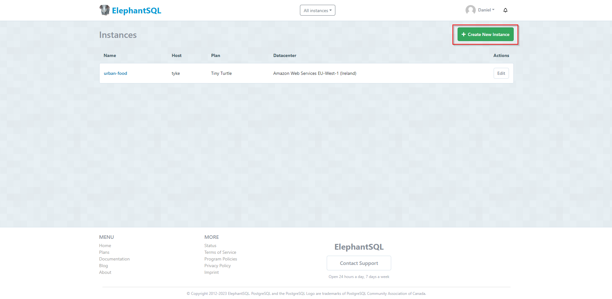
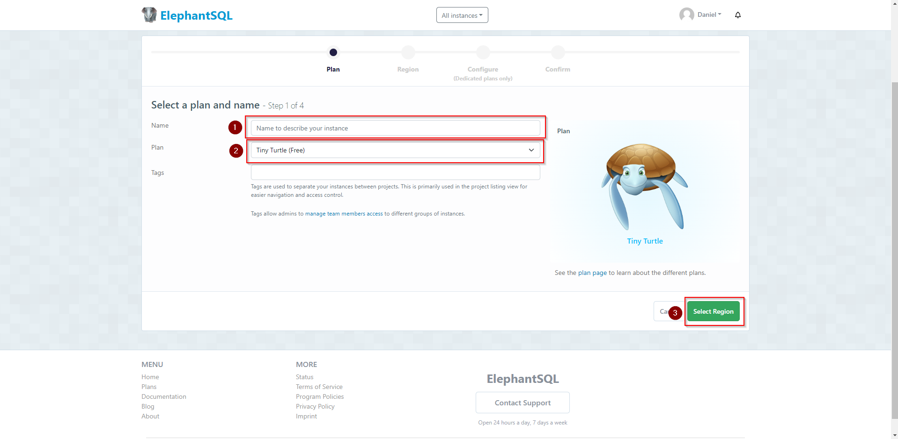
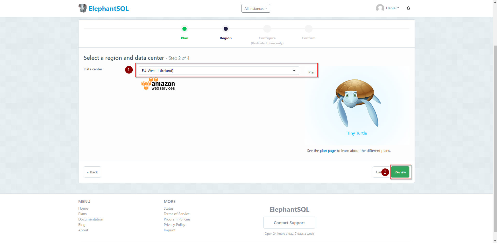
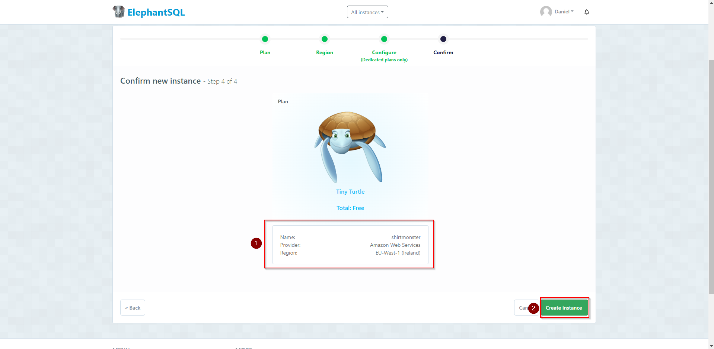
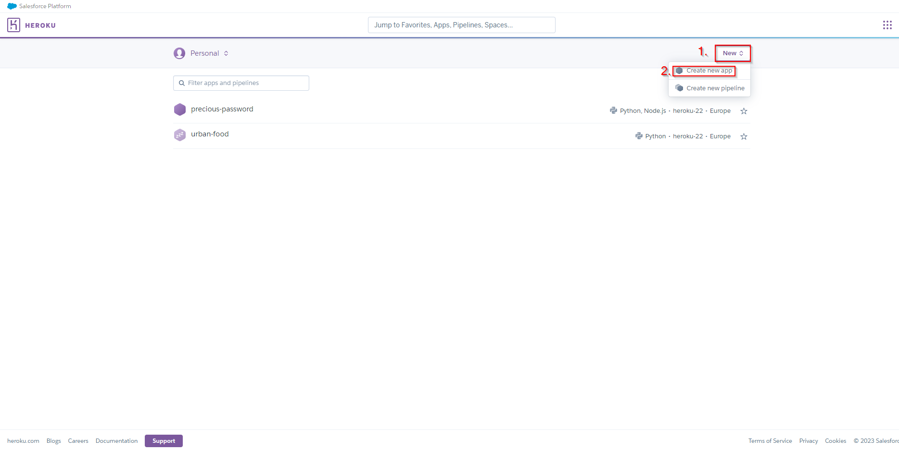
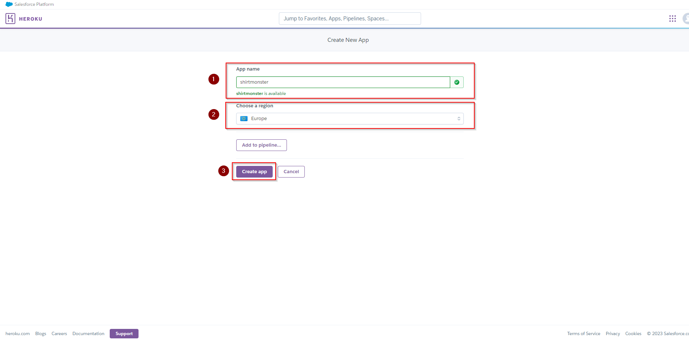
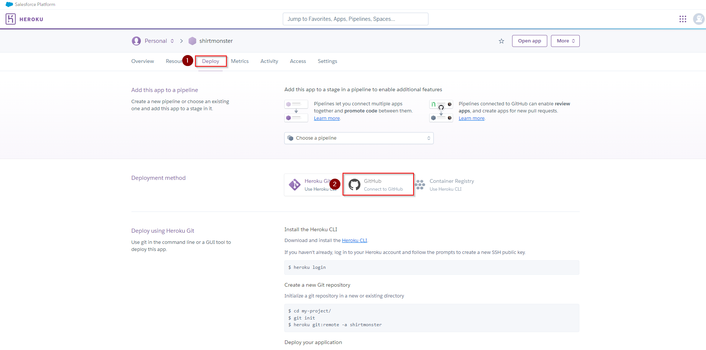
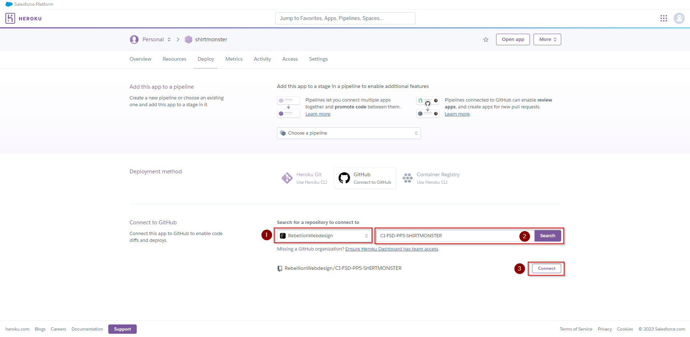
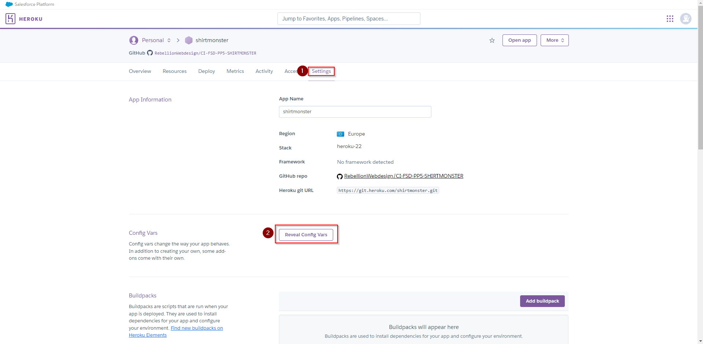
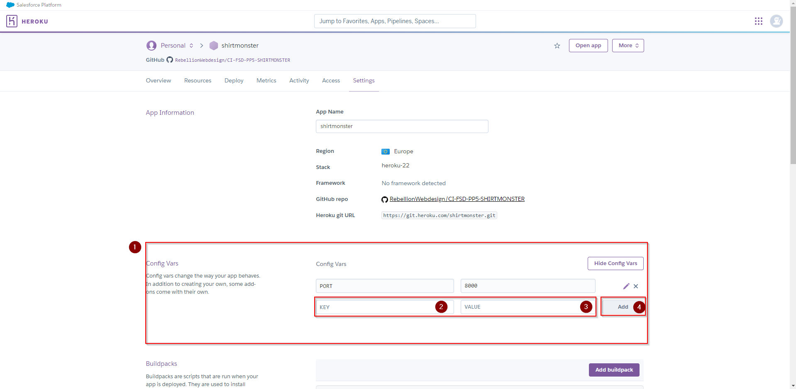

## TABLE OF CONTENTS

[toc]

## OVERVIEW

Overview text here
## UX

### PROJECT GOAL

Goal text here

### PROJECT OBJECTIVES

Objectives as list
### SCOPE

#### DELIVER A SIMPLE AND INTUITIVE UX

Deliverables as list
#### RELEVANT CONTENT

Content as list
#### FEATURES

Features as list

#### RESPONSIVENESS

For responsive behaviour the default bootstrap 4.6.2 breakpoints were used:

- Extra Small: < 576px

- Small: <u>></u> 576px

- Medium: <u>></u> 768px

- Large: <u>></u> 992px

- Extra Large: <u>></u> 1200px

### STRUCTURE

Structure image here

### SKELETON

#### Wireframes

Link to wireframes and images here

### DATABASE

Database schema here

### SURFACE

#### COLOR SCHEME

Color scheme as image with explanation here

#### FONTS

For this project the chosen fonts are [Montserrat](https://fonts.google.com/specimen/Montserrat?query=montserrat) and [Poppins](https://fonts.google.com/specimen/Poppins?query=poppins) provided by Google Fonts. Montserrat is used as the main heading font and Poppins is used as the text font.

  
Montserrat

 

  
Poppins

 

#### VISUAL EFFECTS

Short explanation and small gifs here

## AGILE METHODOLOGY

Link to agile tools

## FEATURES

### EXISTING FEATURES

Existing features here

### FUTURE FEATURE CONSIDERATIONS

Future features here

## TOOLS USED

### VSCODE EXTENSIONS

Extensions here

### PYTHON PACKAGES

Packages here

## TESTING

Link to testing md

## DEPLOYMENT

### CREATE A DATABASE ON ELEPHANTSQL

This section describes the creation of an initial database on [ELEPHANTSQL](https://elephantsql.com)

1. Log in to your elephantSQL account or create one
2. On your Instances dashboard click on **Create New Instance**

  
Create an new database on ElephantSQL

   

3. On the next screen select a an instance name then click **Select Region**.

  
New database name and region on ElephantSQL

   

4. Select the region nearest to you. Then click **Review**

  
Select region on ElephantSQL

   

5. On the review tab, check if everything is okay and click **Create Instance**.

  
Create new instance on ElephantSQL

   

ADD STEPS FOR DBURL TO HEROKU

### DEPLOY ON HEROKU

This section explains the deployment steps on [Heroku](https://www.heroku.com)

1. Log in to your Heroku account and create a new app:

  
Create an new app on Heroku

   

2. On the next screen, choose an app name and the where the app should be hosted. **Click "Create app"**.

  
Choose Name and Region on Heroku

   

3. In your app go to the **Deploy tab** and click **GitHub**.

  
Search for your repo on Heroku

   

4. Once clicked a new section will open. Check that the Account is correct and search for your repo name (e.g. CI-FSD-PP5-SHIRTMONSTER in this case). **Click Connect**.

  
Connect your repo with Heroku

   

5. Now we need to make some settings in the app. Go to the **Settings tab** and click on **Reveal Config Vars**.

  
Config Vars Heroku

   

6. Once clicked a new Section will open. Add your settings from your `env.py` file to the **KEY** and **VALUE** field. **Click Add**. Repeat this for every config var you need to have and also add the ones which are for Heroku only.

  
Config Vars Heroku

   

NEEDS EXPANSION ON DEPLOY ERROR BECAUSE OF MISSING URL

### DEPLOY ON A LOCAL MACHINE (Windows)

Deployment explanation here

## CREDITS

### CONTENT

Content credits here

## ACKNOWLEDGEMENTS

Acknowledgements here