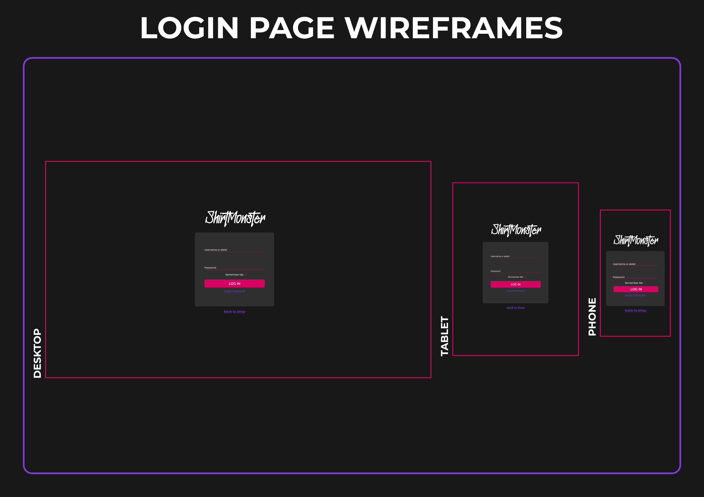
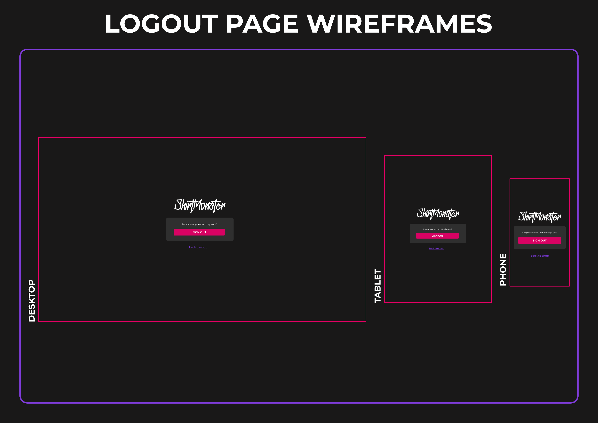
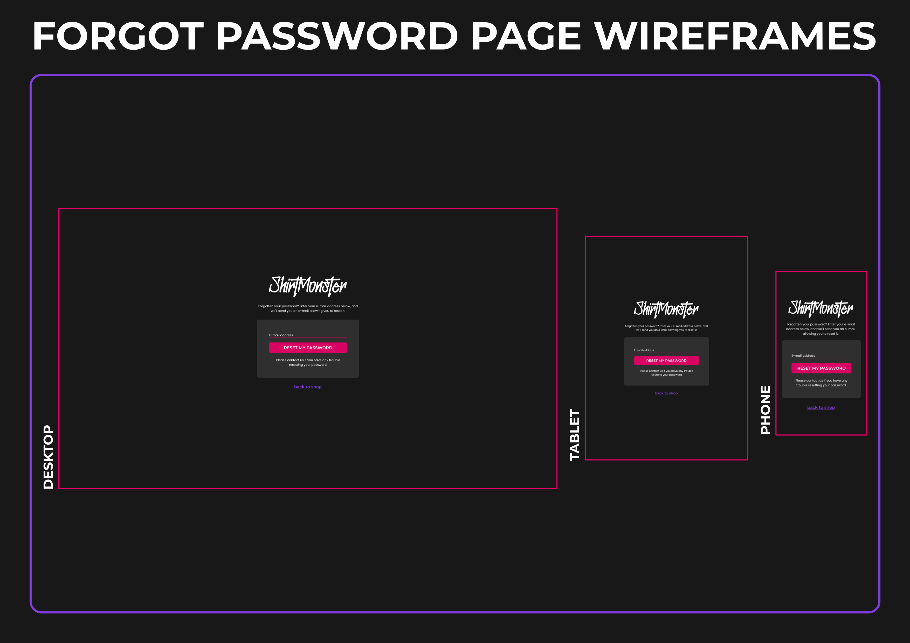
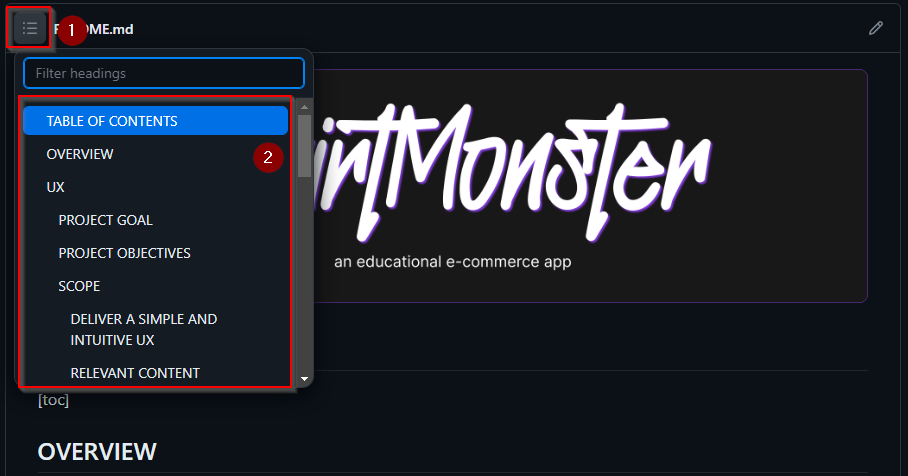

## OVERVIEW

Shirtmonster is an educational eCommerce website where customers can buy apparel products like t-shirts and hoodies. It was created as the 5th portfolio project for the full stack developer course at [Code Institute](https://codeinstitute.net/). The app is written with [Django](https://www.djangoproject.com/), [PosrgeSQL](https://www.postgresql.org/), [HTML](https://developer.mozilla.org/en-US/docs/Web/HTML), [CSS3](https://developer.mozilla.org/en-US/docs/Web/CSS) and [JavaScript](https://developer.mozilla.org/en-US/docs/Web/JavaScript).
## UX

### PROJECT GOAL

Goal text here

### PROJECT OBJECTIVES

Objectives as list
### SCOPE

#### DELIVER A SIMPLE AND INTUITIVE UX

Deliverables as list
#### RELEVANT CONTENT

Content as list
#### FEATURES

Features as list

#### RESPONSIVENESS

For responsive behaviour the default bootstrap 4.6.2 breakpoints were used:

- Extra Small: < 576px

- Small: <u>></u> 576px

- Medium: <u>></u> 768px

- Large: <u>></u> 992px

- Extra Large: <u>></u> 1200px

### STRUCTURE

### SKELETON

#### Wireframes

The wireframes were made using [Figma](https://figma.com). However, the finished wireframes are compiled into page based groups for easy viewing. The complete design file can be downloaded [here](design-files/shirtmonster-designs.fig).

  
Login Page Wireframes

 

  
Logout Page Wireframes

 

  
Password Forgotten Page Wireframes

 

### DATABASE
The app structure is defined by the database tables and their relationships. The following images illustrate the inital and the final database schema. The following database models count as custom models:

- Wishlist
- User Address
- User Payment
- Order

  
PP5 ERD initial

 

### SURFACE

#### COLOR SCHEME

The chosen color theme is compiled of dark backgrounds and colorful elements to give an underground feel to the site. The colors have a good contrast on dark backgrounds and add visual dynamics to the site by using hover effects and gradient backgrounds to visual landmarks.

  
Shirtmonster Color Scheme

 

  
Shirtmonster Main Gradient

 

#### FONTS

For this project the chosen fonts are [Montserrat](https://fonts.google.com/specimen/Montserrat?query=montserrat) and [Poppins](https://fonts.google.com/specimen/Poppins?query=poppins) provided by Google Fonts. Montserrat is used as the main heading font and Poppins is used as the text font.

  
Montserrat

 

  
Poppins

 

#### VISUAL EFFECTS

##### BUTTON HOVER EFFECTS

- To give the user visual feedback for certain elements, hover effects were added mainly to the cta button links.

  
Button Hover Effects

 

##### NAVIGATION HOVER EFFECTS AND ACTIVE STATE

- The navbar also has hover effects for the navigation links, the hover color is applied when the user clicks the link and is on the corresponsing page. In the example the user is on the home page which has the applied hover color.

  
Navbar Hover Effects

 

## AGILE METHODOLOGY

Link to agile tools

## FEATURES

### EXISTING FEATURES

Existing features here

### FUTURE FEATURE CONSIDERATIONS

Future features here

## TOOLS USED

### VSCODE EXTENSIONS

Extensions here

### PYTHON PACKAGES

Packages here

### OTHER  TOOLS

- The database schematics were created with [dbdiagram.io](https://dbdiagram.io/)
- Wireframes were created with [Figma](https://www.figma.com), the .fig file can be found [here](design-files)
- The Product base images were generated with [MidJourney AI](https://www.midjourney.com/) and post processed with [Affinity Photo](https://affinity.serif.com/) to generate the mockups
- The Product texts (product description, category description) were generated with [ChatGPT](https://chat.openai.com/auth/login)

## TESTING

Link to testing md

## DEPLOYMENT

### CREATE A DATABASE ON ELEPHANTSQL

This section describes the creation of an initial database on [elephantSQL](https://elephantsql.com)

1. Log in to your elephantSQL account or create one
2. On your Instances dashboard click on **Create New Instance**

  
Create an new database on ElephantSQL

   

3. On the next screen select a an instance name then click **Select Region**.

  
New database name and region on ElephantSQL

   

4. Select the region nearest to you. Then click **Review**

  
Select region on ElephantSQL

   

5. On the review tab, check if everything is okay and click **Create Instance**.

  
Create new instance on ElephantSQL

   

ADD STEPS FOR DBURL TO HEROKU

### DEPLOY ON HEROKU

This section explains the deployment steps on [Heroku](https://www.heroku.com)

1. Log in to your Heroku account and create a new app:

  
Create an new app on Heroku

   

2. On the next screen, choose an app name and the where the app should be hosted. **Click "Create app"**.

  
Choose Name and Region on Heroku

   

3. In your app go to the **Deploy tab** and click **GitHub**.

  
Search for your repo on Heroku

   

4. Once clicked a new section will open. Check that the Account is correct and search for your repo name (e.g. CI-FSD-PP5-SHIRTMONSTER in this case). **Click Connect**.

  
Connect your repo with Heroku

   

5. Now we need to make some settings in the app. Go to the **Settings tab** and click on **Reveal Config Vars**.

  
Config Vars Heroku

   

6. Once clicked a new Section will open. Add your settings from your `env.py` file to the **KEY** and **VALUE** field. **Click Add**. Repeat this for every config var you need to have and also add the ones which are for Heroku only.

  
Config Vars Heroku

   

NEEDS EXPANSION ON DEPLOY ERROR BECAUSE OF MISSING URL

### DEPLOY ON A LOCAL MACHINE (Windows)

Deployment explanation here

## CREDITS

- Creating a table of contents isn´t needed anymore. GitHub does this automatically now. Please see below how to open them:

  

    
Open table of content on GitHub

     
  

## ACKNOWLEDGEMENTS

Acknowledgements here