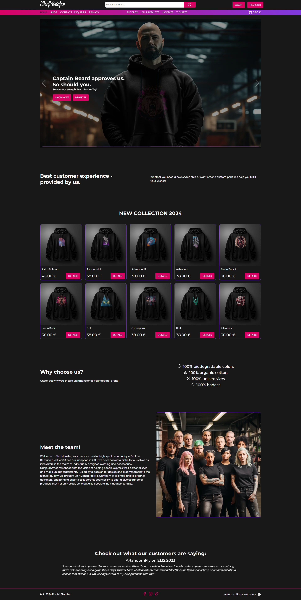

## COMPATIBILITY

For cross-browser compatibility the browsers Google Chrome and Firefox Developer Edition were tested. Apple devices were omitted because I don´t own any. The tests were conducted on the deployed site.

### CHROME:

  
Homepage Desktop View

 

  
Homepage Tablet View

 

  
Homepage Phone View

 

  
Shop Desktop View

 

### FIREFOX:

  
TITLE HERE

 

## RESPONSIVE BEHAVIOR:

Explanatory text here

### CHROME:

  
TITLE HERE

 

### FIREFOX:

  
TITLE HERE

 

### RESPONSIVELY:

  
RESPONSIVELY CRITICAL BREAKPOINTS

 

## AUTOMATIC TESTING

For this MVP there were no automatic tests done.

## MANUAL TESTING

| FEATURE      | ACTION      | EXPECTED RESULT  | ACTUAL RESULT | TESTED    | PASSED    | COMMENTS     |
| ------------ | ----------- | ---------------- | ------------- | --------- | --------- | ------------ |
| FEATURE HERE | ACTION HERE | EXPECTATION HERE | RESULT HERE   | BOOL HERE | BOOL HERE | COMMENT HERE | 

## CODE VALIDATION

### W3C VALIDATION HERE

### CSS VALIDATION HERE

### JS VALIDATION HERE

### PYTHON VALIDATION HERE

## BUGS

- A very bad bug which I can not solve for now is that the update_total() function from the walkthrough works only in the cart. I could not pinpoint why the function returns NULL for the related fields on save. This needs to be fixed in the future.
