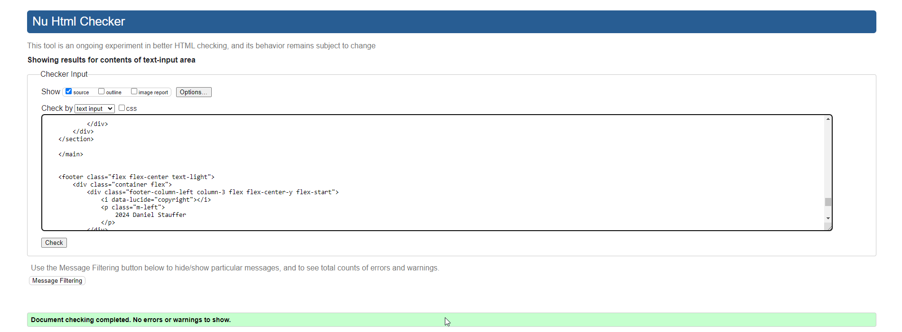
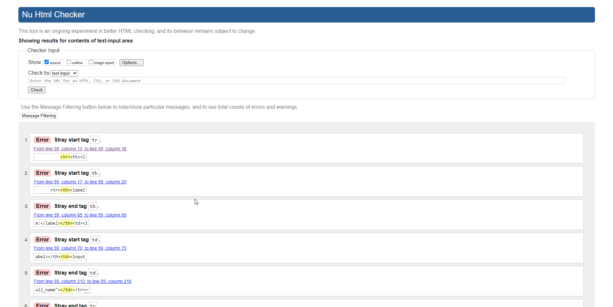
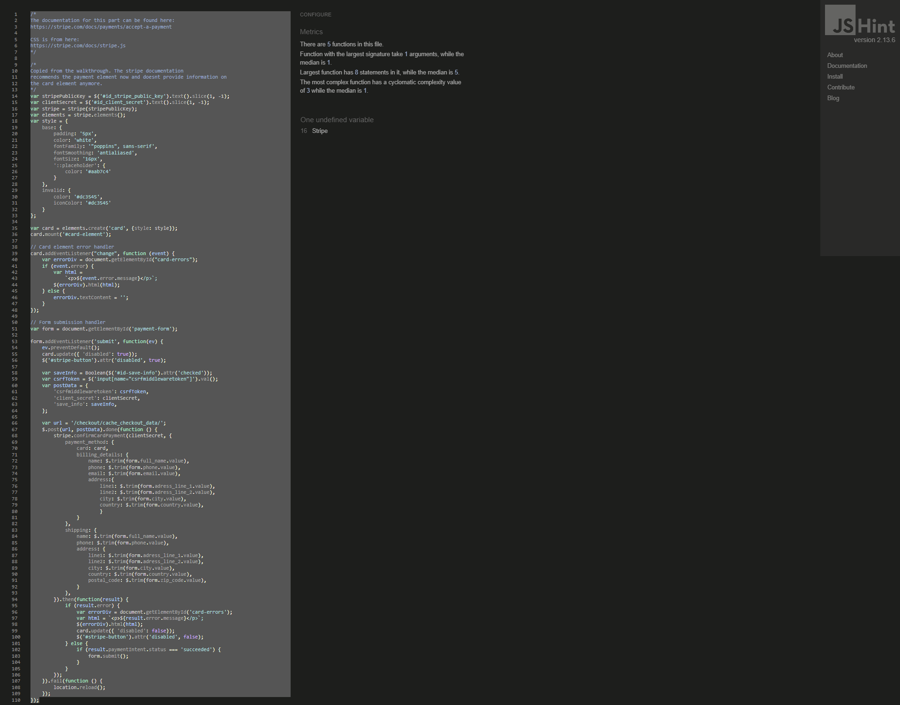

## COMPATIBILITY

For cross-browser compatibility the browsers Google Chrome and Firefox Developer Edition were tested. Apple devices were omitted because I don´t own any. The tests were conducted on the deployed site. For the sake of readbility and to not overwhelm readers I will include representative screenshots from the landing page, forms and the cart. All other screenshots are in the repository if the reader wishes to view them beyond assessment testing.

### CHROME:

  
Landing Page Responsive

 

  
Contact Page Responsive

 

  
Cart Page Responsive

 

### FIREFOX:

  
Landing Page Responsive

 

  
Contact Page Responsive

 

  
Cart Page Responsive

 

## AUTOMATIC TESTING

For this MVP there were no automatic tests done.

## MANUAL TESTING

NOTE: Most of the features are available to guests as well as registered users. If a feature is only for registered users it is filed under the related category, if a feature is for all users it will be filed as a guest test.

| FEATURE                                                      | ACTION                                                       | EXPECTED RESULT                                              | ACTUAL RESULT                                                | TESTED | PASSED | COMMENTS                       |
| ------------------------------------------------------------ | ------------------------------------------------------------ | ------------------------------------------------------------ | ------------------------------------------------------------ | ------ | ------ | ------------------------------ |
| **NAVIGATION AS GUEST**                                      |                                                              |                                                              |                                                              |        |        |                                |
| Hover effects for links                                      | hover over links                                             | links turn dark                                              | links turn dark                                              | YES    | YES    |                                |
| Hover effects for buttons                                    | hover over buttons                                           | buttons lighten up                                           | buttons lighten up                                           | YES    | YES    |                                |
| CTA hover effects                                            | hover over buttons                                           | buttons lighten up                                           | buttons lighten up                                           | YES    | YES    |                                |
| Social links hover effects                                   | hover over icons                                             | icons lighten up                                             | icons lighten up                                             | YES    | YES    |                                |
| Social links open in new tab                                 | click social icon link                                       | pages open in new tab                                        | pages open in new tab                                        | YES    | YES    |                                |
| Active State                                                 | select link                                                  | selected link turns dark                                     | selected link turns dark                                     | YES    | YES    |                                |
| Links open in same tab                                       | click link                                                   | pages open in same tab                                       | pages open in same tab                                       | YES    | YES    |                                |
| **NAVIGATION AS USER**                                       |                                                              |                                                              |                                                              |        |        |                                |
| When logged in login button changes                          | log in                                                       | log in button changes to log out                             | log in button changes to log out                             | YES    | YES    |                                |
| When logged in wishlist icon shows                           | log in                                                       | list icon shows in user nav on the left side                 | list icon shows in user nav on the left side                 | YES    | YES    |                                |
| When logged in user profile icon shows                       | log in                                                       | user icon shows in user nav on the left side                 | user icon shows in user nav on the left side                 | YES    | YES    |                                |
| When logged in register CTA disappears                       | log in                                                       | register CTA disappears                                      | register CTA disappears                                      | YES    | YES    |                                |
| **CONTACT / INQUIRIES AS GUEST**                             |                                                              |                                                              |                                                              |        |        |                                |
| Form shows placeholders marked as mandatory                  | Go to contact page                                           | mandatory placeholders have star                             | mandatory placeholders have star                             | YES    | YES    |                                |
| Form uploads without image                                   | fill form without image                                      | shows info message and uploads                               | shows info message and uploads                               | YES    | YES    |                                |
| Form uploads with image                                      | fill form with image                                         | shows success message and uploads                            | shows success message and uploads                            | YES    | YES    |                                |
| **CONTACT / INQUIRIES AS USER**                              |                                                              |                                                              |                                                              |        |        |                                |
| Form is prefilled with user data                             | log in and go to contact                                     | form shows user data                                         | form shows user data                                         | YES    | YES    |                                |
| Form uploads without image                                   | fill form without image                                      | shows info message and uploads                               | shows info message and uploads                               | YES    | YES    |                                |
| Form uploads with image                                      | fill form with image                                         | shows success message and uploads                            | shows success message and uploads                            | YES    | YES    |                                |
| **SHOP AS GUEST**                                            |                                                              |                                                              |                                                              |        |        |                                |
| Guest can view product details                               | click DETAILS on card                                        | shows details, hides to wishlist button                      | shows details, hides to wishlist button                      | YES    | YES    |                                |
| Guest can add product to cart                                | click BUY                                                    | shows success message, adds to cart                          | shows success message, adds to cart                          | YES    | YES    |                                |
| Guest can change cart quantity                               | in cart increase quantity, click UPDATE                      | Increases cart quantity and payment amount                   | Increases cart quantity and payment amount                   | YES    | YES    |                                |
| Guest can delete from cart                                   | in cart, click DELETE                                        | shows warning, deletes on confirm, shows success             | shows warning, deletes on confirm, shows success             | YES    | YES    |                                |
| Guest can add to cart from shop page                         | in shop, click BUY on card                                   | shows success message, adds to cart                          | shows success message, adds to cart                          | YES    | YES    |                                |
| **CHECKOUT AS GUEST**                                        |                                                              |                                                              |                                                              |        |        |                                |
| Form shows madatory fields with star                         | buy item, go to checkout                                     | form has star on mandatory fields                            | form has star on mandatory fields                            | YES    | YES    |                                |
| After form submit, checkout success is shown                 | finish checkout process                                      | order summary is shown                                       | order summary is shown                                       | YES    | YES    | ~~has the update_total() bug~~ |
| Register and Login buttons are shown in form                 | buy item, go to checkout                                     | buttons are shown                                            | buttons are shown                                            | YES    | YES    |                                |
| **CHECKOUT AS USER**                                         |                                                              |                                                              |                                                              |        |        |                                |
| Form is prefilled with user data                             |                                                              | user data is shown in form                                   | user data is shown in form                                   | YES    | YES    |                                |
| User can save info to profile                                | buy item, go to checkout                                     | opt-in is selected and shown                                 | opt-in is selected and shown                                 | YES    | YES    |                                |
| **WISHLIST**                                                 |                                                              |                                                              |                                                              |        |        |                                |
| User can add item to wishlist from product detail page       | go to product details, click TO WISHLIST                     | item is added, success message                               | item is added, success message                               | YES    | YES    |                                |
| User can add to cart from wishlist                           | go to wishlist, click BUY                                    | item is added, success message                               | item is added, success message                               | YES    | YES    |                                |
| User can delete item from wishlist                           | go to wishlist, click REMOVE                                 | item is removed, success message                             | item is removed, success message                             | YES    | YES    |                                |
| Wishlist checks if item is already in list                   | go to product details,add item more than once                | item is not added, info message                              | item is not added, info message                              | YES    | YES    |                                |
| **CART SECURITY**                                            |                                                              |                                                              |                                                              |        |        |                                |
| Items can not be added more than five times                  | update quantity in cart > 5                                  | item is not added, error message, quantity is set back to five | item is not added, error message, quantity is set back to five | YES    | YES    |                                |
| **USER PROFILE**                                             |                                                              |                                                              |                                                              |        |        |                                |
| form shows placeholders with stars for mandatory fields      | register, go to profile                                      | form shows placeholders with star                            | form shows placeholders with star                            | YES    | YES    |                                |
| If user has address, form is prefilled                       | register, go to profile                                      | form shows user data                                         | form shows user data                                         | YES    | YES    |                                |
| Order history shows text if it is empty                      | register, go to profile                                      | list shows text                                              | list shows text                                              | YES    | YES    |                                |
| Order history shows orders as list if orders are there, order number is link | register, go to profile                                      | list shows orders                                            | list shows orders                                            | YES    | YES    |                                |
| Click on order number shows related order and testimonial box, box is empty | register, go to profile, click order number                  | order details and testimonial box are shown                  | order details and testimonial box are shown                  | YES    | YES    |                                |
| Testimonial gets saved on submit, text above box changes     | write a testimonial                                          | success message, box is saved, text changes                  | success message, box is saved, text changes                  | YES    | YES    |                                |
| If Testimonial, content is shown and can be updated          | update existing testimonial                                  | success message, box is saved, testimonial changes           | success message, box is saved, testimonial changes           | YES    | YES    |                                |
| **GENERAL SECURITY**                                         |                                                              |                                                              |                                                              |        |        |                                |
| User wishlist must not be reachable via url                  | enter /user/wishlist in url                                  | redirect to login                                            | redirect to login                                            | YES    | YES    |                                |
| User profile must not be reachable via url                   | enter /profiles/show_user/7 in url                           | redirect to login                                            | redirect to login                                            | YES    | YES    |                                |
| User order detail must not be reachable via url              | enter /profiles/order_detail/F66D19D442F942E48C103D2A5215F4E5 in url | redirect to login                                            | redirect to login                                            | YES    | YES    |                                |

## CODE VALIDATION

### W3C VALIDATION

#### BASE HTML

  
Base HTML results

 

#### CART HTML

  
Cart HTML results

 

#### HOME HTML

  
Home HTML results

 

#### PRIVACY HTML

  
Privacy HTML results

 

#### SHOP HTML

  
Shop HTML results

 

#### WISHLIST HTML

  
Wishlist HTML results

 

***NOTE: The following screenshots contain errors either produced by django itself or by libraries like django-countries. These are not fixable for me, because I would need to change the package code which will most likely be overwritten by a future aupdate which may occur. The viable option would be to provide valid html to the developers github repository via pull request.***

#### CHECKOUT HTML

  
Checkout HTML results

 

  
Checkout HTML error proof

 

#### CONTACT/INQUIRIES HTML

  
Contact HTML results

 

  
Contact HTML error proof

 

#### PROFILE HTML

  
Profile HTML results

 

  
Profile HTML error proof

 

### CSS VALIDATION

  
JIGSAW CSS validation

 

  
JIGSAW CSS validation warnings

 

The CSS warnings come from Swiper included via CDN.

### JS VALIDATION

  
JSHINT result for main.js

 

  
JSHINT result for stripe.js

 

The warnings about unused and undefined variables come from Stripe and Swiper. They are included via CDN..

### PYTHON VALIDATION

#### CART APP

  
Cart Views PEP8 Result

 

  
Cart Tools PEP8 Result

 

  
Cart Contexts PEP8 Result

 

#### CHECKOUT APP

  
Checkout Views PEP8 Result

 

  
Checkout Models PEP8 Result

 

#### CUSTOM SHIRT APP

  
Custom Shirt Models PEP8 Result

 

  
Custom Shirt Views PEP8 Result

 

  
Custom Shirt Admin PEP8 Result

 

#### HOME APP

  
Home Views PEP8 Result

 

#### PRODUCTS APP

  
Products Models PEP8 Result

 

  
Products Views PEP8 Result

 

  
Products Admin PEP8 Result

 

#### PROFILES APP

  
Profiles Models PEP8 Result

 

  
Profiles Views PEP8 Result

 

  
Profiles Forms PEP8 Result

 

  
Profiles Admin PEP8 Result

 

#### SHOP APP

  
Shop Views PEP8 Result

 

#### TESTIMONIAL APP

  
Testimonial Models PEP8 Result

 

  
Products Forms PEP8 Result

 

  
Products Admin PEP8 Result

 

#### WISHLIST APP

  
Wishlist Models PEP8 Result

 

  
WishlistWishlist Views PEP8 Result

 

### WAVE VALIDATION

  
WAVE Homepage results

 

  
WAVE Shop-Page results

 

  
WAVE Privacy results

 

  
WAVE Cart results

 

  
WAVE Custom Shirt results

 

### LIGHTHOUSE TESTS

  
Lighthouse Homepage Result Desktop

 

## BUGS

- ~~A very bad bug which I can not solve for now is that the update_total() function from the walkthrough works only in the cart. The function is returning NULL on save and reverts back to its default value of 0. I could not find out why this is happening. You can reproduce this by deleting the `default=0` attribute from the Order model and trying to save an order. The error will show the issue. However, this needs to be fixed urgently.~~
  - **This issue was fixed by changing the `self.save()` method to `super().save()` and adding the tax field to the database. Upon order completion all relevant data is saved to the database and gets displayed in the checkout success summary.**

- A smaller bug is that the filter links arent colored when they are clicked. This is happening because the main.js function handling the coloring is an if/else block checking the URL. This can be solved by adding a different visual marker. Due to time constraints this couldnt be implemented.

